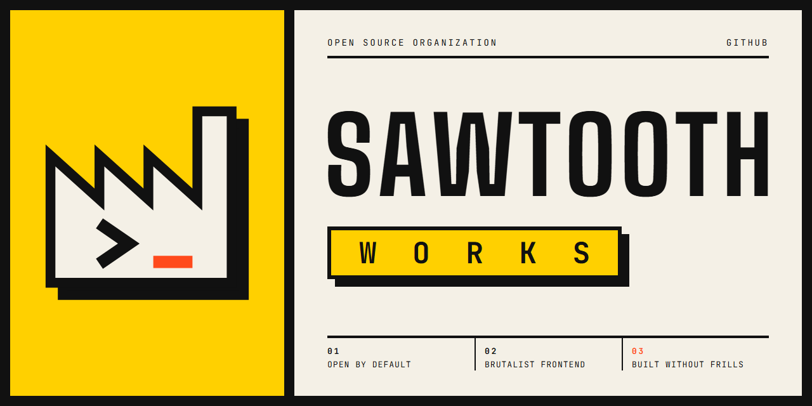

<p align="center">
  
</p>

> [!WARNING]
> **Fabriqueta de Software is becoming Sawtooth Works.**
> If a repository, link, clone, CI run or install stopped working, the rename is the most likely cause.
> See [Something broke?](#something-broke) for quick fixes.

## Sawtooth Works

Open source software built like a factory floor: raw structure, visible joints, nothing added for decoration.

We build back-ends and libraries in the open, and every frontend we ship follows the same **brutalist** standard: thick borders, hard shadows, flat color and layouts that show how they are built.

| # | Principle | In practice |
|:--|:--|:--|
| **01** | **Open by default** | Code lives in public, free to use, study and improve. |
| **02** | **Brutalist frontend** | Structure you can see. No gradients, no glass, no ornament. |
| **03** | **Built without frills** | Every feature has to earn its place. |

## Use of AI

> [!NOTE]
> **We use AI only for documentation.**
> READMEs, guides and other docs may be written with AI assistance. Source code is not.

## On the workshop floor

| Repository | What it is | Stack |
|:--|:--|:--|
| [**saas-and-ecommerce-boilerplate-nestjs**](https://github.com/sawtooth-works/saas-and-ecommerce-boilerplate-nestjs) | Modular starting point for SaaS and e-commerce back-ends: authentication, RBAC/ABAC, product catalog, Stripe checkout and observability. | NestJS · Prisma · PostgreSQL |
| [**brasil-cities**](https://github.com/sawtooth-works/brasil-cities) | JavaScript library for Brazilian states, cities and IBGE codes. | JavaScript · npm |

## Something broke?

The organization moved from `github.com/FabriquetaDeSoftware` to `github.com/sawtooth-works`.
GitHub redirects most things automatically, but not everything:

| What | After the rename | What to do |
|:--|:--|:--|
| Web links to repositories | **Redirected** | Nothing. Update bookmarks when you can. |
| `git clone`, `pull` and `push` using the old URL | **Redirected** | Update your remote (see below). |
| Organization page `github.com/FabriquetaDeSoftware` | **404** | Use [`github.com/sawtooth-works`](https://github.com/sawtooth-works). |
| API calls using the old organization name | **404** | Replace `FabriquetaDeSoftware` with `sawtooth-works`. |
| Team mentions like `@FabriquetaDeSoftware/team` | **Not redirected** | Use `@sawtooth-works/team`. |
| CI configs, badges, submodules, package manifests or scripts with the old name hard-coded | **May break** | Search and replace the old name (see below). |
| The `brasil-cities` package on npm | **Not affected** | Nothing. `npm install brasil-cities` still works. |

> [!IMPORTANT]
> The redirects only last while nobody else claims the old name. Update your references now rather than relying on them.

**Point your local clone to the new address**

```bash
git remote set-url origin https://github.com/sawtooth-works/<repository>.git
```

Using SSH:

```bash
git remote set-url origin git@github.com:sawtooth-works/<repository>.git
```

**Find leftover references to the old name**

```bash
git grep -in "FabriquetaDeSoftware"
```

Still broken? Open an issue in the affected repository and mention the rename.

## Contributing

Issues and pull requests are welcome in every public repository.
Found something that still points to the old name? A pull request fixing it is the most useful contribution right now.

---

<sub>Formerly <b>Fabriqueta de Software</b> · <code>github.com/FabriquetaDeSoftware</code> → <code>github.com/sawtooth-works</code></sub>
